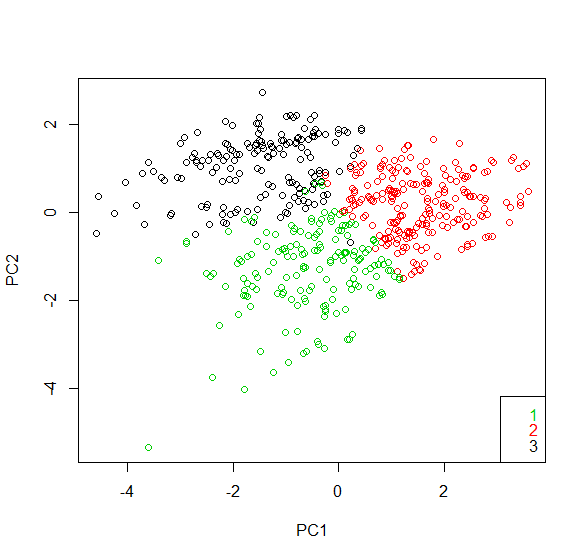

# Gene Data Clustering Analysis

## **Objective:**
The objective of this project is to use R to to train an unsupervised learning model for clustering of gene data. The Partitioning by Medoids (PAM) and K-means algorithms were run for different number of clusters to determine the optimal number of clusters that maximizes the silhouette width. Then, clustering was performed to parition the gene data into the optimal number of clusters. Afterwards, Principal Component Analysis (PCA) was performed on the gene data. 

## **Tools:**
1.	R - cluster 

## **Screenshot:**
Plot of the 1st and 2nd principal components with colour-coded PAM clusters

